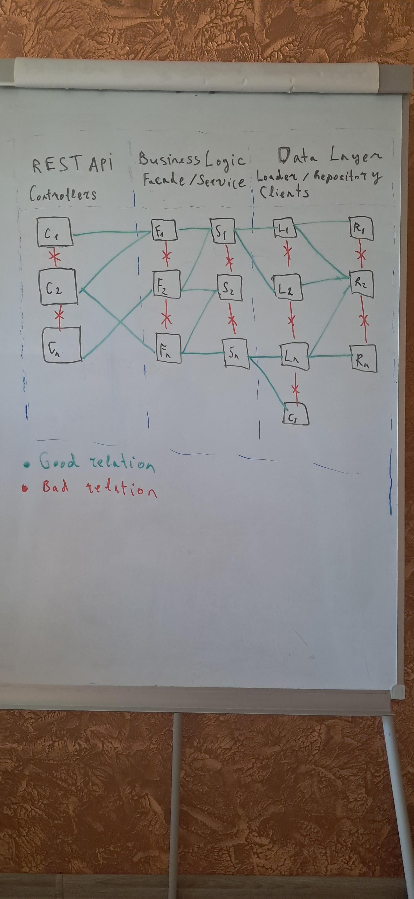

# Video Metadata API

A RESTful API for managing video metadata.

## Prerequisites

- **Operating System:** Linux
- **Java:** Version 24
- **Maven:** Latest version
- **Docker:** Latest version

## Getting Started

To start the application, run the following command in the `vms` project directory:

```sh
sh run-vms-app.sh
```

This command builds and runs the Docker container, then automatically opens Swagger UI in your default browser at [http://localhost:8090/swagger-ui/index.html](http://localhost:8090/swagger-ui/index.html).

## API Documentation & Authentication

Swagger UI provides comprehensive API documentation with examples.

**Authentication Steps:**
1. Use the `/auth/login` endpoint to obtain a token.
2. Two user roles are available: **ADMIN** and **USER**.
3. Copy the token and paste it into the Swagger "Authorize" dialog (top-right corner).
4. Once authorized, you can access endpoints for video management and health checks.

## Architecture Overview

The project follows a layered architecture. While the implementation uses four layers, a fifth **Facade** layer is described for completeness, as it is commonly used in production systems to orchestrate services.



### Philosophy of Layered Architecture

Layered architecture organizes code into distinct tiers, each with specific responsibilities. This approach promotes:

- **Separation of Concerns:** Each layer handles a particular aspect of the application.
- **Loose Coupling:** Changes in one layer have minimal impact on others.
- **Testability:** Layers can be tested in isolation.
- **Maintainability:** Easier to understand, modify, and extend the codebase.

### 5-Layer Component Architecture

Below is an overview of the proposed 5-layer structure:

#### 1. REST API Layer (Controllers)

**Components:** Controllers (e.g., Spring `@RestController`)

**Responsibilities:**
- Handles incoming HTTP requests (GET, POST, PUT, DELETE, etc.).
- Serializes/deserializes JSON/XML request and response bodies.
- Performs initial input validation (e.g., required fields, format checks) using annotations like `@Valid`, `@NotBlank`, `@Pattern`.
- Delegates business processing to the Business Logic Layer.
- Maps exceptions to appropriate HTTP status codes and error messages.

**Communication:**
- Receives HTTP requests from clients.
- Passes API DTOs (Request/Response Models) to the Facade layer.

#### 2. Business Logic Layer – Facade

**Components:** Facades (e.g., `VideoFacade`, `AuthFacade`)

**Responsibilities:**
- Provides a simplified, high-level interface to controllers.
- Orchestrates calls to multiple services to fulfill business use cases.
- Manages coarse-grained transactions and authorization checks.

**Communication:**
- Receives API DTOs from controllers and passes to services.

#### 3. Business Logic Layer – Service

**Components:** Services (e.g., `VideoService`, `AuthService`)

**Responsibilities:**
- Implements core business rules and operations.
- Performs detailed, semantic validation based on business logic.
- Manages fine-grained transactions and temporary business state.
- Orchestrates data access via Loader.

**Communication:**
- Receives business DTOs from Facade.
- Passes DTOs or parameters to Loader or Client components.

#### 4. Data Layer – Loader

**Components:** Loaders (e.g., `VideoLoader`, `UserLoader`)

**Responsibilities:**
- Aggregates and composes data from multiple sources.
- Abstracts data source details (e.g., database, external APIs).
- Maps raw data to domain entities.
- Validates data before or after data interactions

**Communication:**
- Receives parameters from Service components.
- Passes queries to Repository or Client components.
- Operates primarily with Entities and returns them to the Service layer.

#### 5. Data Layer – Repository

**Components:**
- **Repositories:** (e.g., Spring Data JPA `VideoRepository`, `UserRepository`) for database interactions.

**Responsibilities:**
- Provides low-level CRUD operations for entities.
- Manages database connections.
- Translates domain operations into technology-specific commands.

**Communication:**
- Receives entities or query parameters from Loader or Service components.
- Sends queries or API requests to the actual data source.

**CLients** - are same layer as Loader but instead of communicating with components database they handle external communication.
